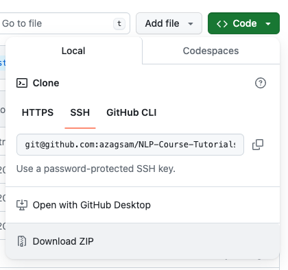
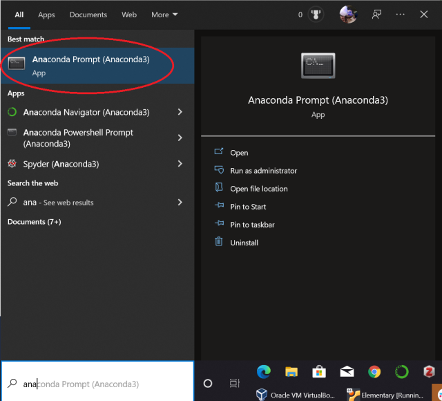

# Basic skills for NLP course

# Table of Contents

1. **Introduction**
2. **Terminal Navigation**
3. **Repository Management**
4. **Python Environment Setup**
    - Using Anaconda
    - Using venv
    - Google Colab

# Introduction


### Terminal Navigation, Repository Management, Virtual Environment 

The **terminal**, initially daunting, becomes a powerful tool with the mastery of a few basic commands, enabling you to download repositories, navigate directories, and handle files with ease. 

A **repository**, or repo, serves as a central storage for all project-related files and resources. This section outlines methods for downloading a repository, either manually through the web interface or using the `git clone` command in the terminal, providing a straightforward approach to saving repositories in desired locations and ensuring easy access to project files.

In the modern era of programming, especially when dealing with complex projects involving numerous packages and dependencies, the concept of **virtual environments** has become a cornerstone. These isolated environments allow developers to manage dependencies, avoid conflicts, and ensure that projects are reproducible across different machines and setups. Whether you're a beginner taking your first steps in programming or an experienced developer working on intricate projects, understanding how to create and manage virtual environments is crucial.

# Terminal Navigation Guide for Beginners

Navigating the terminal can seem daunting at first, but with a few basic commands, you'll be able to download repositories, navigate directories, and manage files with ease. Here’s a simple guide to get you started:

### Opening the Terminal
- **Windows**: Search for `Command Prompt` or `PowerShell` in the Start menu.
- **MacOS**: Open `Terminal` from Applications > Utilities.
- **Linux**: Use the shortcut `Ctrl + Alt + T` or search for `Terminal` in your applications.

### Navigating Directories
- `pwd` (Print Working Directory): Shows the current directory you're in.
- `ls` (List): Lists files and directories in the current directory.
- `cd <directory>` (Change Directory): Moves you to the specified directory. Replace `<directory>` with the name of the directory you want to move to.
  - Use `cd ..` to go up one directory level.

### Listing Files and Directories
- Use `ls` to see a list of files and directories in your current location.
- To see more details, use `ls -l` for a long listing format, which includes file permissions, number of links, owner, group, size, and timestamp.

### Other Helpful Commands
- `mkdir <directory-name>`: Creates a new directory.
- `touch <file-name>`: Creates a new empty file.
- `rm <file-name>`: Deletes a file. Be cautious with this command.
- `rm -r <directory-name>`: Deletes a directory and all its contents. Use with extreme caution.
- `nano <file-name>` or `vim <file-name>`: Opens the file in a text editor within the terminal. Replace `<file-name>` with the name of the file you wish to edit.

### Exiting the Terminal
- Type `exit` and press Enter, or simply close the terminal window.


Remember, the terminal is very powerful, and commands like `rm` can permanently delete your data. Always double-check the command you're about to run if you're unsure about its effects.


# Repository Management

## Downloading a Repository
- Manually: Click green button `Code` and Download ZIP


- From terminal:
  - First, you need to have `git` installed. If it's not installed, you can download it from [git-scm.com](https://git-scm.com/).
  - To download a repository, use: `git clone <repository-url>`. Replace `<repository-url>` with the URL of the Git repository you want to download.
  - This will create a new directory in your current location containing the repository.

## Saving the Repository to a Specific Location
- If you want to save the repository in a specific location, first navigate to that location using the `cd` command.
- Once you're in the desired directory, use the `git clone` command to download the repository there.


# Setting Up Python Environments for NLP course

This guide provides instructions for setting up Python environments using Google Colab, Anaconda, and Python's built-in `venv` module. Each method has its own benefits depending on your project requirements.

## Google Colab

[Google Colab](https://colab.research.google.com/) provides a pre-configured environment with the added benefit of access to a GPU for a limited time. However, it has its own limitations, such as dependency on internet connectivity and less control over the environment.

- **Advantages**: Easy to start, no installation required, free access to GPUs.
- **Limitations**: Internet-dependent, limited session times, less customization.

## Anaconda

Anaconda is a popular distribution for data science and machine learning projects, simplifying package management and deployment.

### Install Anaconda

Download and install Anaconda from [here](https://docs.anaconda.com/free/anaconda/install/index.html).

### Anaconda and System PATH

When installing Anaconda on macOS and Linux, the installer typically adds Anaconda to the system PATH automatically. This allows you to run Anaconda and its tools from your terminal without any additional configuration.


- #### Windows
On Windows computers, Anaconda recommends that you use the Anaconda Prompt CLI to work with conda.
Windows users have a unique tool called "Anaconda Prompt" that comes with the Anaconda installation. To manage environments and packages with Anaconda on Windows, it's recommended to use the Anaconda Prompt. This specialized terminal is configured to use Anaconda's tools and packages, ensuring that commands such as `conda create` or `conda activate` work seamlessly.



### Set Up an Anaconda Environment
Execute the following commands in terminal (Linux/macOS) or Anaconda Prompt (Windows):
```Bash
conda create -n nlp python=3.10
conda activate nlp
pip install --upgrade pip
pip install -r requirements.txt
python -m ipykernel install --user --name=nlp
pip install jupyterlab
python install-models-and-data.py
```
Restart the terminal to ensure all changes take effect. After that, run the following commands:
```Bash
conda activate nlp
jupyter lab
```

## Setting Up an Anaconda Environment Detailed Steps Explanation

1. `conda create -n nlp python=3.10`
   - This command creates a new Conda environment named `nlp` with Python version 3.10 installed. Environments are isolated spaces, ensuring that projects with different dependencies do not interfere with each other.

2. `conda activate nlp`
   - Activates the newly created `nlp` environment, making it the current working environment. All subsequent package installations and executions will be confined to this environment.

3. `pip install --upgrade pip`
   - Upgrades `pip`, the Python package installer, to the latest version within the active environment. Ensuring `pip` is up-to-date is crucial for installing the latest versions of packages and avoiding potential conflicts.

4. `pip install -r requirements.txt`
   - Installs all the Python packages listed in the `requirements.txt` file. This file should contain a list of package names with optional versions, ensuring that all necessary dependencies for your project are installed. For example, a line in `requirements.txt` might look like `numpy==1.18.5` to install a specific version of NumPy.

5. `python -m ipykernel install --user --name=nlp`
   - Installs an IPython kernel for the environment, which allows Jupyter notebooks to use the environment as a kernel. By naming the kernel after the environment (`nlp` in this case), it makes it easy to identify and select this environment within Jupyter interfaces.

6. `pip install jupyterlab`
   - Installs JupyterLab, an interactive development environment for notebooks, code, and data. JupyterLab is an extension of Jupyter Notebooks and provides a flexible and powerful tool for data analysis and visualization.

7. `python install-models-and-data.py`
   - Runs a custom Python script named `install-models-and-data.py`. This script should contain commands to install additional models or datasets required for your project. Since this step is project-specific, the contents of the script will vary depending on your needs. For example, it might download a pre-trained machine learning model or a specific dataset from the internet.

# Pure Python Installation
The venv module comes with Python and is used to create isolated Python environments.

# Setting Up a Python Environment with venv

This guide details the steps to set up a Python environment using the `venv` module, which is included by default in Python 3.3 and later. This method is useful for creating isolated environments for different projects.

## Install Python 3.10

1. Download and install Python 3.10 from [Python's official website](https://www.python.org/downloads/).
   - Ensure that you add Python to your system's PATH during the installation process to easily access Python from your terminal.

## Set Up a Virtual Environment
Open the terminal and run the following commands:
```Bash
python3.10 -m venv .venv
source .venv/bin/activate
pip install --upgrade pip
pip install -r requirements.txt
python -m ipykernel install --user --name=.venv  
pip install jupyterlab 
python install-models-and-data.py 
```
Restart the terminal to ensure all changes take effect. After that, run the following commands:
```Bash
source .venv/bin/activate
jupyter lab
```

## Environment activation on Windows
To activate venv on Windows, use `.venv\Scripts\activate`